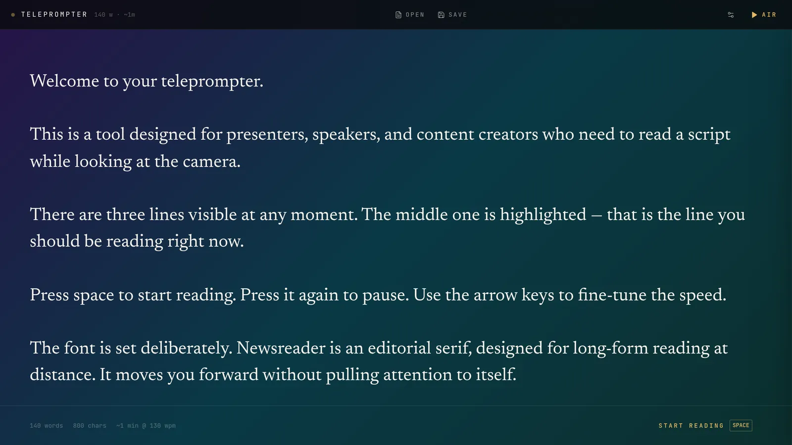
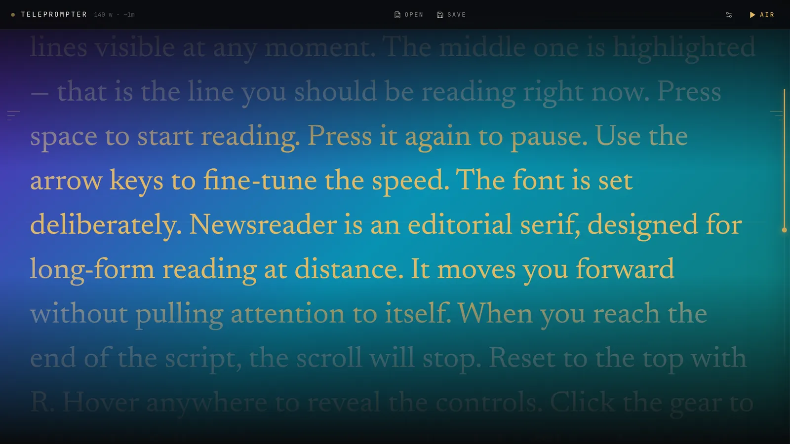
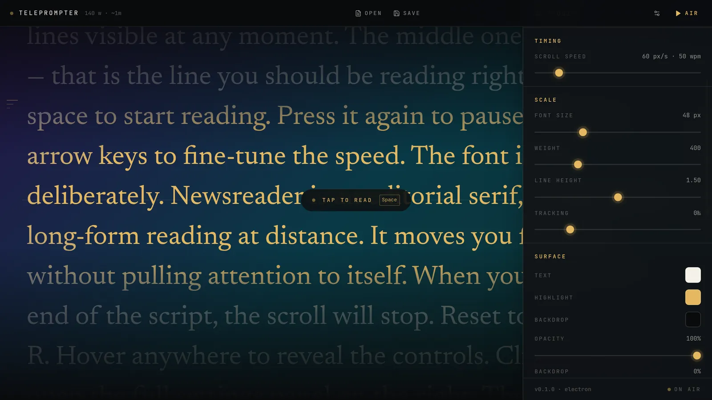

# Teleprompter

A cross-platform desktop teleprompter for presenters and creators. It follows your voice as you read, fully offline. Built with Electron, React, TypeScript and Tailwind.

**Website & downloads:** [teleprompter.sandboxlabs.uk](https://teleprompter.sandboxlabs.uk)

| Editor | Display | Studio controls |
| --- | --- | --- |
|  |  |  |

## Features

- **Three-line viewport** with a centered highlighted line and pixel-smooth, continuous scrolling (not line-by-line)
- **Voice tracking:** press **Listen** and read aloud. An offline speech-to-text model ([Vosk](https://alphacephei.com/vosk/), Spanish / English) matches what you say against the script, marks the spoken text and adapts the scroll speed to your pace
- **Dictation:** in the editor, press **Dictate** (or `Ctrl + D`) and speak. Your words are written at the cursor, with a live preview until you pause. Stop keeps a half-finished phrase
- **Markdown:** `.md` files (and unsaved scripts that look like Markdown) render formatted in display mode: headings, bold / italic / strikethrough, lists and task lists, quotes, links, inline and block code, and rules. Front matter and images are skipped. The editor keeps the raw source, and voice tracking follows the text without the syntax
- **Studio-style control panel:** scroll speed, font size, weight, line height and tracking, plus themes, text / highlight colors, backdrop and window opacity
- **Window controls:** always-on-top (3 levels), mirrored text, and click-through mode for mouse passthrough
- **Scripts:** new / open / save `.txt` and `.md`. Save writes back to the opened file, and the titlebar shows its name with a `•` when there are unsaved changes
- Countdown before going live
- Right-edge progress rail with a glowing position indicator
- Settings, window position and window size are persisted across launches

### Speech models

Voice tracking and dictation run entirely on your machine, and no audio leaves your computer. The first time you use a language, its small Vosk model (~40 MB) is downloaded from `alphacephei.com` and cached in the app's user-data directory. The language is detected from the script automatically, or you can pin it in **Settings → Voice**.

## Keyboard shortcuts

When the window is focused:

| Key | Action |
| --- | --- |
| `Space` | Start reading from the editor; play / pause in display mode |
| `↑` / `↓` | Speed ±5 px/s |
| `←` / `→` | Nudge scroll position ±60 px |
| `R` | Reset to top |
| `H` | Toggle the controls panel |
| `Esc` | Back to editor / hide panel / stop dictating |
| `Ctrl + D` | Start / stop dictation (editor) |
| `Ctrl + N` / `Ctrl + O` | New script / open file |
| `Ctrl + S` / `Ctrl + Shift + S` | Save / save as |

Global (system-wide):

| Key | Action |
| --- | --- |
| `Ctrl + Alt + Space` | Show / hide the window |
| `Ctrl + Alt + P` | Toggle always-on-top |

## Getting started

### Requirements

- Node.js 20 or newer
- npm 10+ (or the pnpm / yarn equivalent)

On Debian / Ubuntu you may also need:

```bash
sudo apt install libnss3 libatk-bridge2.0-0 libgbm1 libxss1 libasound2t64
```

macOS and Windows need no extra steps.

### Development

```bash
npm install
npm run dev          # launch the app with HMR
npm run typecheck    # type-check the main and renderer processes
npm run build        # production bundle in ./out
```

On Linux, `npm run dev` sets `NO_SANDBOX=1` so Electron's SUID sandbox helper isn't required in development. The packaged builds run with the sandbox enabled.

### Packaging

```bash
npm run build:linux  # AppImage + .deb
npm run build:mac    # DMG (x64 + arm64)
npm run build:win    # NSIS installer
```

Output is written to `release/<version>/`.

The `.deb` post-install script handles Ubuntu 23.10+, where AppArmor blocks unprivileged user namespaces: it installs an AppArmor profile for the app (like Chrome and VS Code do), and falls back to the SUID sandbox if that fails.

## Project layout

```
src/
├── main/            Electron main process: window, IPC, global hotkeys, STT model download
├── preload/         contextBridge API exposed as window.teleprompter
├── shared/          settings, themes, IPC channel names, STT types
└── renderer/src/    React UI
    ├── components/  Editor, Teleprompter (display), Titlebar, ControlsPanel, Countdown
    ├── hooks/       scroll engine, speech recognition, settings, hotkeys
    └── lib/         script matcher, Markdown, language detection, dictation
scripts/             Puppeteer probes and end-to-end STT tests (with audio fixtures)
site/                static landing page
deploy/              nginx config and install script for the landing page
```

## Hiding it from screen sharing

The window is frameless and transparent. To keep the teleprompter visible to you but not to your audience:

- Lower **Opacity** in the settings panel and place the window over your slides
- Or share a specific window (for example your slide deck, or OBS "Window capture") instead of the whole screen

## License

[MIT](LICENSE) © 2026 Gustavo Azambuja
